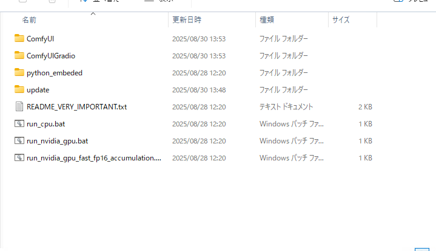
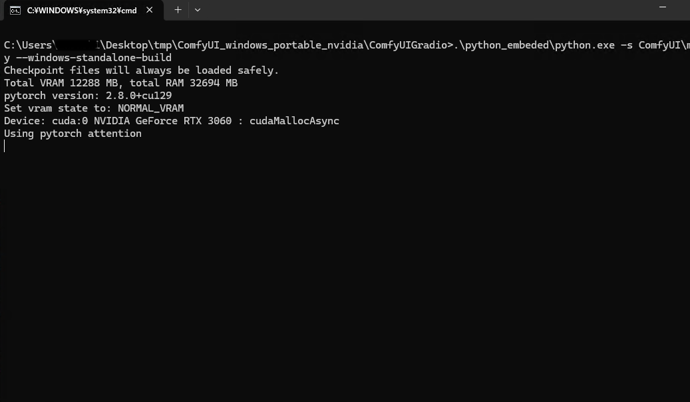
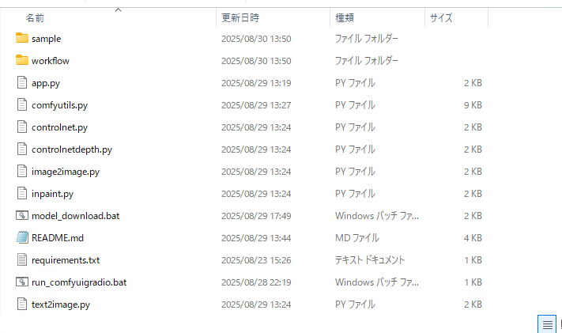
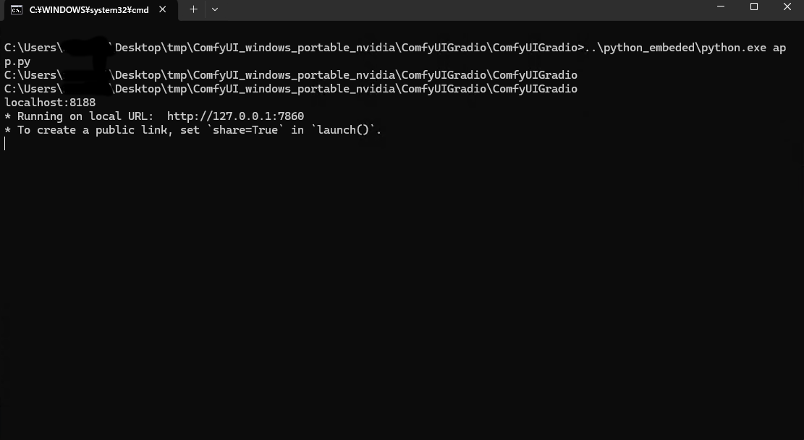

# インストールと起動

## Windows + NVIDIAのグラフィックボードの場合
ComfyUI 本体と実行に必要な Python 等必要なプログラム、さらに必要なモデルすべてひとまとめにした
Windows 用配布パッケージを用意しました。ファイルサイズが非常に大きい(約 26 GB)ので、
ストレージの容量や通信量に気を付けてください。

[こちら](https://huggingface.co/asfdrwe/WAI14DMD2-GGUF/resolve/main/ComfyUIGradio.zip)を
クリックしてダウンロードしてください。ComfyUIGradio をインストールしたいフォルダにファイルを
移動させ、右クリックしすべて展開を選びファイルを展開してください。

### 実行

`ComfyUIGradio` フォルダを開き、`ComfyUI_windows_portable` フォルダを開いてください。



`run_nvidia_gpu.bat` をダブルクリックして ComfyUI を実行します。



黒画面に文字が表示されるターミナルと、ブラウザ上でComfyUI 標準の UI が起動します。ブラウザの方は
閉じてもかまいません。



次に `ComfyUIGradio` フォルダに戻り、中の `ComfyUIGradio` を開き、`run_comfyuigradio.bat`をダブル
クリックしてください。 ターミナルで ComfyUIGradio が起動し、ブラウザが開かれます。




### 終了方法

ComfyUI のターミナルと ComfyUIGradio のターミナルとブラウザを閉じてください。

## Linux の場合や手動でインストールする場合

### ComfyUI のインストール

[公式サイト](https://github.com/comfyanonymous/ComfyUI?tab=readme-ov-file#manual-install-windows-linux)などを
参考に ComfyUI をインストールしてください。

Radeon については[Radeon 7800 XT のメモ](https://qiita.com/asfdrwe/items/ae05a15ae42fb65c8dd2) も参考にどうぞ。

カスタムノードは、[ComfyUI-GGUF](https://github.com/city96/ComfyUI-GGUF)と[ComfyUI-DepthAnythingV2](https://github.com/kijai/ComfyUI-DepthAnythingV2)を使うので、
これらを`git`でインストールしてください。

`ComfyUI`フォルダ以下で
```
cd custom_nodes
git clone https://github.com/city96/ComfyUI-GGUF
cd ComfyUI-GGUF
pip install -r requirements.txt 
cd ..
git clone https://github.com/kijai/ComfyUI-DepthAnythingV2
cd ComfyUI-DepthAnythingV2
pip install -r requirements.txt 
cd ..
```

### ComfyUIGradio のインストール
python 3.13 と git をインストールしてください。　

`git` でファイルを取得し、`venv`でPython環境を構築して有効にし、`pip`で必要な
モジュールをインストールします。

```
git clone https://github.com/asfdrwe/ComfyUIGradio
cd ComfyUIGradio
python3.13 -m venv venv
. venv/bin/activate
pip install -r requirements.txt
```

### 実行

ターミナルで ComfyUI を起動してください。別のターミナルで
```
python app.py
```
で ComfyUIGradio を起動してください。

### 終了方法
ターミナルで Ctrl+C を押して、ComfyUI や ComfyUIGradio を終了させてください。

### Radeon での動画生成の注意点
Fedora 42 + Radeon RX 7800 XT は ComfyUI の動作がいまいちです。

画像生成の場合、ComfyUI を `--use-split-cross-attention --force-fp16 --fp16-vae `付きで起動しないと
VAE デコーディング時に VRAM 不足でタイリングになる場合があるので生成が遅くなります。

また動画生成の場合、ComfyUI を `--use-quad-cross-attention --force-fp16 --bf16-vae --lowvram`付きで
起動しないと VRAM 不足になります。

実行コマンド例:
```
python main.py --use-quad-cross-attention --bf16-vae --lowvram --force-fp16 --auto-launch
```

また、動画生成時、何度も Wan モデルのロードしようとすると、モデルのロードで動作が止まります。
ComfyUIGradio では使えるようにしていませんが、LoRA を切り替える場合も、Wan モデルのロードで動作が止まります。
ComfyUIGradio2 で利用できる High と Low の 2 つのモデルを使う Wan 2.2 も切り替えの際のロードで止まるので
うまく動かせていません。

## 起動オプション
ComfyUI を別のマシンで動かしている場合、次のオプションで接続できます。

- --server_addr ComfyUIを実行しているマシンのIPアドレス
- --server_port ComfyUIを実行しているポート番号

Windows の場合エディタで`run_comfyuigradio.bat` の`python app.py`の箇所を次のように修正してください。

```
python app.py --server_addr ComfyUIのIPアドレス --server_port ComfyUIのポート番号
```
